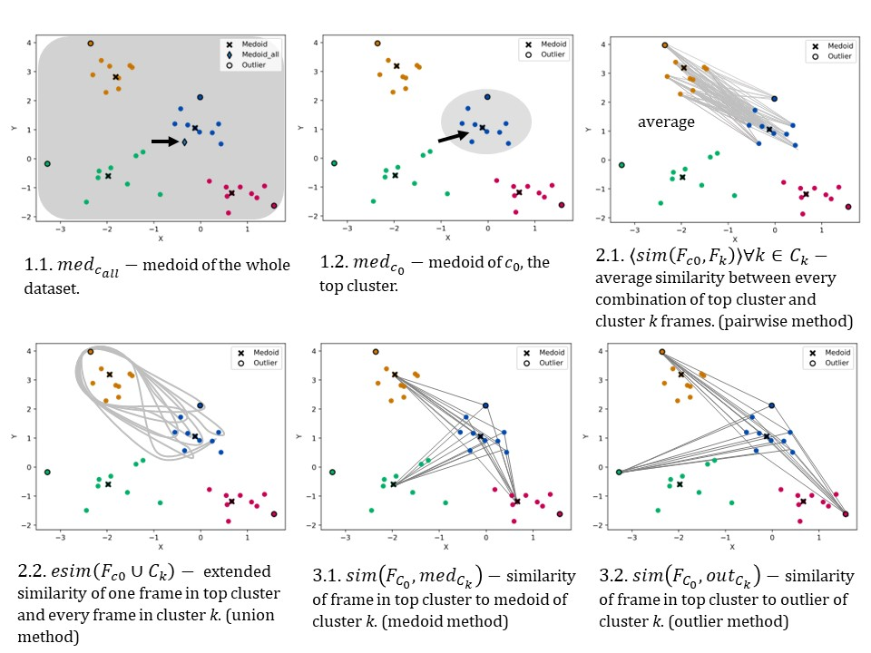

<h3 align="center"> 
    </a>
    &nbsp
    <p><b>🪄 Predict Protein Structure with Precision 🪄</b></p>
    </h3>

#### Table of Contents
- [Overview](#overview)
- [Installation](#installation)
- [Tutorial](#tutorial)
  - [1. Cluster Trajectories](#1-cluster-trajectories)
  - [2. Cluster Normalization](#2-cluster-normalization)
  - [3. Similarity Calculations](#3-similarity-calculations)
  - [4. Representative Frames](#4-representative-frames)
- [Further Reading](#further-reading)

## Overview

<table>
  <tr>
    <td>
      <p>Protein structures prediction is important because the accuracy of protein structures influence how our understanding of its function and its interactions with other molecules, which can help to design new drugs to target specific molecular interactions. <b>Protein Retrieval via Integrative Molecular Ensembles (PRIME)</b> is a novel algorithm that predicts the native structure of a protein from simulation or clustering data. This repo contains six different ways of determining the native structure of biomolecules from simulation or clustering data. These methods perfectly mapped all the structural motifs in the studied systems and required unprecedented linear scaling.</p>
    </td>
    <td>
      <figure>
        
        <figcaption><i>Fig 1. Superposition of the most representative structures found with extended indices (yellow) and experimental native structures (blue) of 2k2e.</i></figcaption>
      </figure>
    </td>
  </tr>
</table>

## Tutorial
The following tutorial will guide you through the process of determining the native structure of a biomolecule using the PRIME algorithm. If you do not have clustered data. Please refer to other clustering algorithms such as [NANI](nani.md) to cluster your data. If you already have clustered data, please skip to step 2.

### 1. Cluster Trajectories
[scripts/outputs/postprocessing.ipynb](../scripts/outputs/postprocessing.ipynb) will use the indices from last step to extract the designated frames from the original trajectory for each cluster. This will require a cluster assignment file from the clustering algorithm.

### 2. Cluster Normalization
[scripts/prime/normalize.py](../scripts/prime/normalize.py) With already clustered data, this script will normalize the trajectory data between $[0,1]$ using the Min-Max Normalization. 

    # System info - EDIT THESE
    input_top = '../../examples/md/aligned_tau.pdb'
    unnormed_cluster_dir = '../outputs/labels_*'
    output_dir = 'normed_clusters'
    output_base_name = 'normed_clusttraj'
    atomSelection = 'resid 3 to 12 and name N CA C O H'
    n_clusters = 6

#### Inputs
##### System info
`input_top` is the topology file used in the clustering. <br>
`unnormed_cluster_dir` is the directory where the clustering files are located from step 3. <br>
`output_dir` is the directory where the normalized clustering files will be saved. <br>
`output_base_name` is the base name for the output files. <br>
`atomSelection` is the atom selection used in the clustering. <br>
`n_clusters` is the number of clusters used in the PRIME. If number less than total number of cluster, it will take top *n* number of clusters. <br>

```bash
python normalize.py
```

#### Outputs
1. `normed_clusttraj.c*.npy` files, normalized clustering files.
2. `normed_data.npy`, appended all normed files together.

### 3. Similarity Calculations
[scripts/prime/exec_similarity.py](../scripts/prime/exec_similarity.py) generates a similarity dictionary from running PRIME. 

- `-h` - for help with the argument options.
- `-m` - methods, pairwise, union, medoid, outlier (*required*).
- `-n` - number of clusters (*required*).
- `-i` - similarity index, RR or SM (*required*).
- `-t` - Fraction of outliers to trim in decimals (default is None).
- `-w` - Weighing clusters by frames it contains (default is True).
- `-d` - directory where the `normed_clusttraj.c*.npy` files are located (*required*)
- `-s` - location where `summary` file is located with population of each cluster (*required*)

#### Example 
```bash
python ../../src/modules/PRIME/similarity_cl.py -m union -n 6 -i SM -t 0.1  -d normed_clusters -s ../nani/outputs/summary_6.csv
```
To generate a similarity dictionary using data in [normed_clusters](../scripts/prime/normed_clusters) (make sure you are in the prime directory) using the union method (2.2 in *Fig 2*) and Sokal Michener index. In addition, 10% of the outliers were trimmed. You can either `python exec_similarity.py` or run example above.

#### Outputs
`w_union_SM_t10.txt` file with the similarity dictionary.
The result is a dictionary organized as followes:
Keys are frame #. Values are [cluster 1 similarity, cluster #2 similarity, ..., average similarity of all clusters].

### 4. Representative Frames
[scripts/prime/exec_rep_frames.py](../scripts/prime/exec_rep_frames.py) will determine the native structure of the protein using the similarity dictionary generated in step 5.

-`h` - for help with the argument options.
-`m` - methods (for one method, None for all methods)
-`s` - folder to access for `w_union_SM_t10.txt` file
-`i` - similarity index (*required*)
-`t` - Fraction of outliers to trim in decimals (default is None).
-`d` - directory where the `normed_clusttraj.c*` files are located (required if method is None)

#### Example 
```bash
python ../../src/modules/PRIME/rep_frames_cl.py -m union -s outputs -d normed_clusters -t 0.1 -i SM
```

#### Outputs
`w_rep_SM_t10_union.txt` file with the representative frames index.

## Further Reading
For more information on the PRIME algorithm, please refer to the [PRIME paper](https://www.biorxiv.org/content/10.1101/2024.03.19.585783v1). 

Please Cite
```bibtex
@article{chen_protein_2024,
	title = {Protein retrieval via integrative molecular ensembles ({PRIME}) through extended similarity indices},
	url = {https://www.biorxiv.org/content/early/2024/03/21/2024.03.19.585783},
	doi = {10.1101/2024.03.19.585783},
	journal = {bioRxiv : the preprint server for biology},
	author = {Chen, Lexin and Mondal, Arup and Perez, Alberto and Miranda-Quintana, Ramon Alain},
	year = {2024},
}
```

</a>

 *Fig 2. Six techniques of protein refinement. Blue is top cluster.* 